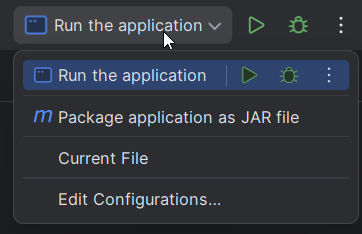

# DAI Practical work 2 (aka BAM - Battleship Added Multiplayer)
This project was realized by Dylan Langumier and Raphaël Perret in the scope of the DAI course, followed at HEIG-VD

---
## Description 
Simple and classic Battleship game playable by two people over the network.  
An application protocol will be created and as well as both client and server applications.  
It will be entirely implemented in Java and released as a docker container.  

Disclaimer: we initially wanted to add Lanterna as a dependency, to have a prettier input/output,
but due to the lack of documentation of this library, the idea was abandoned.

---
## Prerequisite(s)
This application was built against Java 21, and published as a Docker package, therefore either a local installation of 
Docker or Java 21+ is needed to run this application.

# Get the files locally
## Clone
First you will need to clone the application using Git
```bash
git clone https://github.com/Dylan-Langumier/DAI-Practical-Work-2.git
```
## Download source code
Or by downloading the [source code](https://github.com/Dylan-Langumier/DAI-Practical-Work-2/archive/refs/heads/master.zip)
and then unzipping in into a directory.

## Pull from Docker
Or you can pull the package from Docker
```bash
docker pull ghcr.io/rp2709/bam:latest
```

# How to build
## From Intellij IDEA



Select `Package application as JAR file`, and run the configuration. This will output the JAR file in the [target](./target) folder.

## From your CLI
If you have Maven installed
```bash
mvn dependency:go-offline clean compile package
```

If you do not have Maven, we included a Maven Wrapper, which you can use to build the application:
```bash
./mvnw dependency:go-offline clean compile package
```

## Docker
If you're using Docker, you do not need to build, as the package is ready to serve. Read below on how to use it.

# Get started
All the commands assume the terminal was open in the root folder of the code.

## Help
To run the application, you can start with the basic help command
```bash
java -jar ./target/Battleship-1.0.0.jar --help

# if you're using Docker:
docker run --rm ghcr.io/rp2709/bam # (--help is the default) 
```
```text
Usage: Battleship-1.0.0.jar [-hV] [COMMAND]
A small game to experiment with TCP.
  -h, --help      Show this help message and exit.
  -V, --version   Print version information and exit.
Commands:
  client  Start the client part of the network game.
  server  Start the server part of the network game.
```

## Server
### Purpose
Waits for two players (clients) to connect and starts a game between them.
### How to run
```bash
java -jar ./target/Battleship-1.0.0.jar server --help

# if you're using docker:
docker run --rm ghcr.io/rp2709/bam server --help
```
```text
Usage: Battleship-1.0.0.jar server [-hV] [-m=<maxGames>] [-p=<port>]
Start the server part of the network game.
  -h, --help          Show this help message and exit.
  -m, --max_games=<maxGames>
                      Maximum number of simultaneous games hosted by the server
                        (default : 10).
  -p, --port=<port>   Port to use (default: 6433).
  -V, --version       Print version information and exit.
```

### Actually run the server
```bash
java -jar ./target/Battleship-1.0.0.jar server <-p portToListenTo> 

# if you're using docker:
docker run -p hostPort:portToListenTo --rm ghcr.io/rp2709/bam server -p portToListenTo 
# -p hostPort:portToListenTo is IMPORTANT. And portToListenTo needs to be reused for 
# server inside the container 
```

## Client
### Purpose
Connects to a server and communicates player's actions. It also displays the game and allows the player to input their moves.
### How to run
```bash
java -jar ./target/Battleship-1.0.0.jar client --help

# if you're using docker:
docker run --rm ghcr.io/rp2709/bam client --help
```
```text
Usage: Battleship-1.0.0.jar client [-hV] [-H=<host>] [-p=<port>]
Start the client part of the network game.
  -h, --help          Show this help message and exit.
  -H, --host=<host>   Host to connect to.
  -p, --port=<port>   Port to use (default: 6433).
  -V, --version       Print version information and exit.
```

Actually run the client
```bash
# Example
java -jar ./target/Battleship-1.0.0.jar client -H 77.77.77.77 

# if you're using docker:
docker run --rm -it ghcr.io/rp2709/bam client -H 77.77.77.77
```
The instructions to play the game will be displayed then if the connection was successful.

# Packaging the app with docker
See [package with docker](./docker.md)
